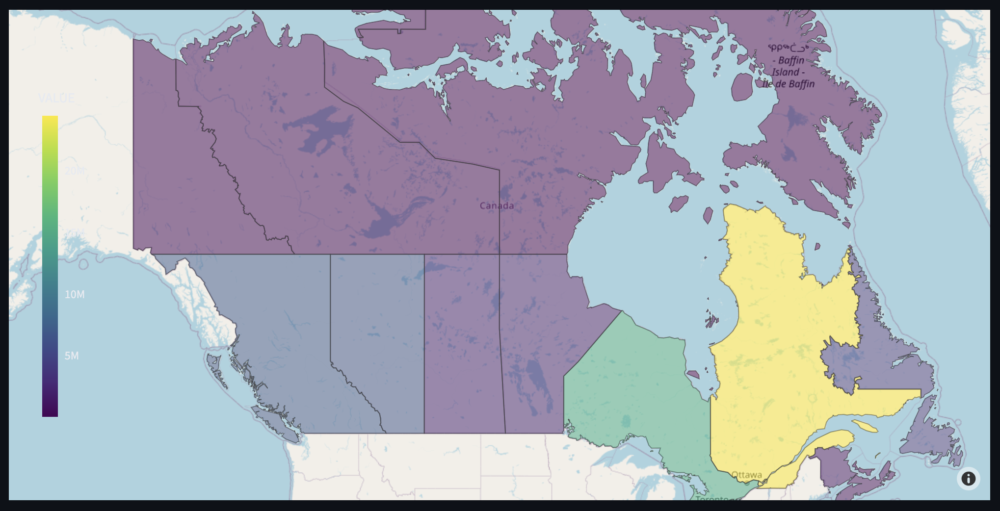

# Interactive Map of Canadian Electricity Generation



## Overview

This project aims to create an interactive map visualizing the sources of electricity generation in each province of Canada. The map is built using the Streamlit framework for creating web applications and the Plotly library for interactive visualizations. Users can select different years, provinces, and other filtering options to dynamically update the map and explore the data.

## Features

- Interactive map of Canada showcasing electricity generation sources in each province.
- Dropdown menus and interactive widgets for year selection, province filtering, and more.
- Real-time updates to the map based on user selections.
- Plotly's choropleth maps to display data variations across provinces.
- Utilizes Streamlit's simplicity for creating web applications with Python.
- Easily customizable to incorporate additional features or data sources.

## Prerequisites

- Python 3.x
- Streamlit
- Plotly

## Installation

1. Clone this repository:

   ```bash
   git clone https://github.com/MusabNaik/Canada-Energy-Generation-Map-Streamlit.git
   ```

2. Navigate to the project directory:

   ```bash
   cd Canada-Energy-Generation-Map-Streamlit
   ```

3. Install the required dependencies:

   ```bash
   pip install -r requirements.txt
   ```

## Usage

1. Run the Streamlit app:

   ```bash
   streamlit run app.py
   ```

2. Access the app in your web browser at `http://localhost:8501`.

3. Use the dropdown menus and interactive widgets to explore the electricity generation data for different provinces and years.

## Data Sources

- Electric power generation, monthly generation by type of electricity: [Statistics Canada ](https://www150.statcan.gc.ca/t1/tbl1/en/tv.action?pid=2510001501)

## License

This project is licensed under the MIT License - see the [LICENSE](LICENSE) file for details.

## Acknowledgments

- Inspired by [Streamlit](https://www.streamlit.io/) and [Plotly](https://plotly.com/) for making interactive data visualization with Python accessible and engaging.

## Author

Musab Naik

## Contact

For questions or inquiries, please contact musab944@gmail.com.